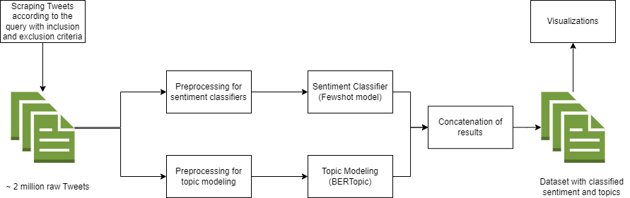

# Advancing Smart Cities through Novel Social Media Text Analysis: A Case Study of Calgary

## Abstract
In numerous cities, population expansion and technological advancements necessitate proactive modernization and integration of technology. However, the existing bureaucratic structure often hinders local officials' efforts to effectively address and monitor residents' needs and enhance the city accordingly. Understanding what people find important and useful can be inferred from their posts on social media. Twitter, as one of the most popular social media platforms, provides us with valuable data that, with the right tools and analysis, can provide insights into the performance of urban services and residents' views of them.

In this study, we used the city of Calgary as an exemplar to gather tweets and analyze topics relating to city development, urban planning, and minorities. Natural language processing (NLP) techniques were used and developed to preprocess stored tweets, classify the sentiment, and identify the topics present in the dataset to eventually provide a set of topics with the prevalent emotion in that topic.

We utilized a variety of methods to analyze the collected data, but BERTopic for topic modeling and few-shot learning using Setfit for sentiment analysis outperformed the others. Hence, we identify issues related to city development, senior citizens, taxes, and unemployment using these methods, and we demonstrate how delving into these analyses can improve urban planning.

## Usage
This repository contains all the files for our methods, including optimization. We have also included details if a particular approach has been tested on Google Collaboratory. 

## Contributing
This is the first of a series of studies on smart cities that will be conducted and assessed. Please do not hesitate to contact me if you have any ideas for the invention or development of novel techniques.

## License
MIT license is used for this project.

## Contact
You can contact me by email (mitrasadat.mirshafie@ucalgary.ca)

